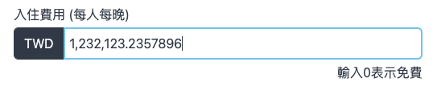
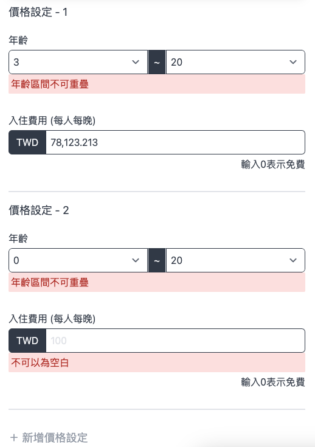

## `Demos`

    

        <h2>Price Input</h2>
        <h3 align="start">Computer<h3>
        
1

        
        
2

        
        
3

        
        <h3 align="start">Mobile<h3>
        
    

    

    

        <h2>Age Group Select</h2>
        <h3 align="start">Computer<h3>
        
1

        
        
2

        
End age can only choose from 15 to 20 now

        
    

    

    

        <h2>Age Group Price List</h2>
        <h3 align="start">Computer<h3>
        
1

        
        
2

        
        
3

        
        <h3 align="start">Mobile<h3>
        
    

    

        <h2>Some other UIs</h2>
        <h3 align="start">Computer<h3>
        
1

        
        
2

        
        <h3 align="start">Mobile<h3>
        
1

        
        
2

        
    

---

### `npm test`

Launches the test runner in the interactive watch mode.
3 unit tests will be operated:

1. addComma test: to test addComma function
   Input: -789,912.3
   Should output: -789,912.3

2. getNumberIntervals test: to test getNumberIntervals
   Input: \[[1, 3], [5, 12], [7, 10], [14, 17]]
   Should output: {
   overlap: \[[7, 10]],
   notInclude: \[[0, 0], [4, 4], [13, 13], [18, 20]]
   }

3. priceInput test: to test priceInput component
   This is component version of addComma
